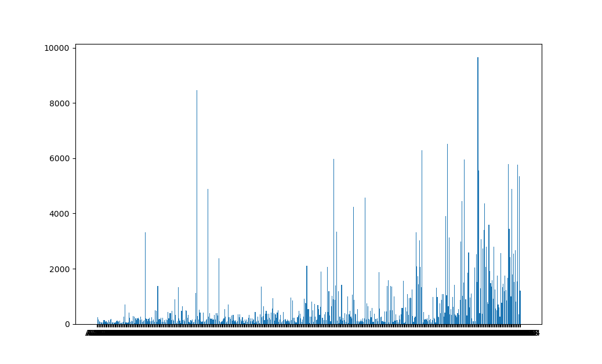

# anglo-saxon-chronicle-graph

## Introduction
This is a quick project aimed at providing some structure while I learned the basics of Spacy, networkx and plotly.  The idea was to do a quick network analysis of the [Anglo Saxon Chronicle](https://en.wikipedia.org/wiki/Anglo-Saxon_Chronicle).

Basic plan was to product a simple network graph of the various people mentioned in the chronicle. As a naive approach, I simple created a edge between any two people mentioned in the same sentence.

Script found in AngloSaxonChronicleGraph.py:

1.  Loads the content of the Anglo Saxon.  (I downloaded a copy from the Gutenberg Project [here](https://www.gutenberg.org/ebooks/657) and then removed the metadata from my local copy to get only the raw Chronicle)
2.  Tokenize the text using Spacy
3.  Identifying people by looking at the tokens labeled as PROPN by Spacy and removing a few special characters from a black list (things like titles were identified by Spacy).  Locations were also removed by comparing to a list of places in the United Kingdom scraped from Wikipedia (source code for spider can be foud in the WikipediaSpider folder)
4.  Create a graph using networkx.  Nodes where all people from Step 3 that are mentioned at least 10 times and Edges defined between any two people mentioned in the same sentence
5.   Generate image of Graph using plotly

##Known Issues
This is still a rough draft mostly used as a learning excercise so there are many rough edges.  A few are:

1. Alogrithm for identitifying people is extremely rudimentary.  Began working on attempting to train Spacy to identify differences between people and locations but it appears to need far more training data then I was interested in manually annotating so went with easier (lazier) method described above
2. Algorithm does not distingish between different people with the same name. For example, there are several different Williams, only one of which is the Conquerer but they are counted together currently
3.  Code needs to be updated

## Some neat outputs

Found the simple graph of text length by year interesting:

And of course the final graph image:

